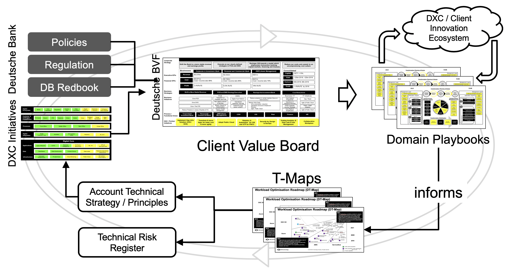
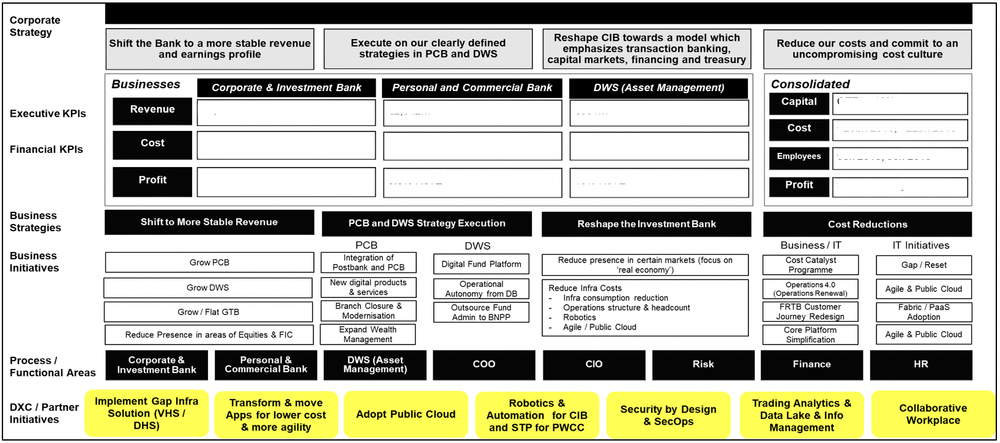
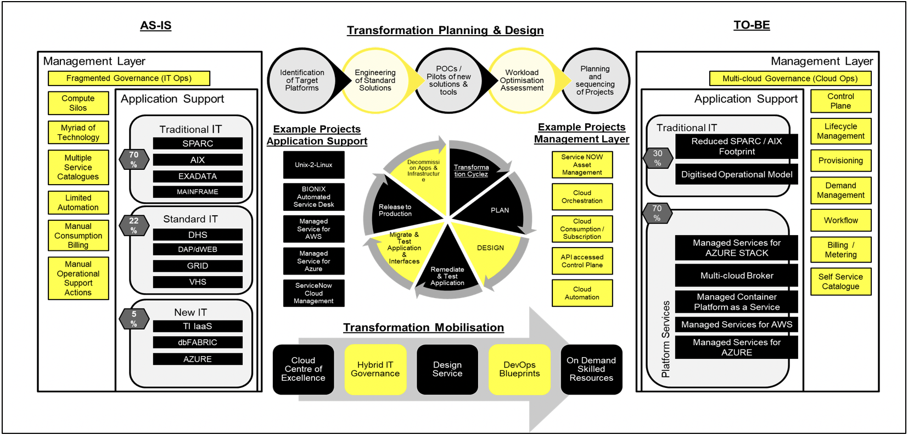
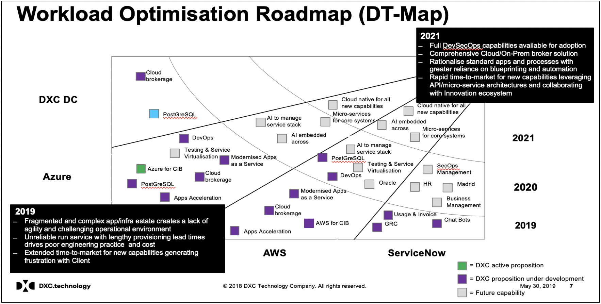

# Client Value Board

The Client Value Board (initially piloted on the Deutsche Bank Client account) is not a formal board in the true corporate governance sense of the word. The CVB is a weekly meeting held to review recent updates and interactions with the client and the account team and to align these interactions with the existing strategy for that client account. The aim is to ensure the strategic goals and outcomes articulated by the client are heard and acted upon whenever we initiate sales motions or pursuits.

Building this strategic client view also provides additionally cross-sell opportunities outwith the account or sector where common issues are solved and synergies can be identified.

Lastly this approach also provides a path to progressive, incremental improvement to existing offerings to ensure relevance and feature fit with clients.

## Structure
- The CVB meeting is chaired by the account or sector CTO and is formally minuted, actions tracked and attendance recorded. Decisions made are captured and updated at the weekly Account or Sector sales interlock meeting (Governance models may vary).
- The account or sector DGM and DSD(s) are mandatory attendees
- OSLs and account or sector head of sales attend on rotation as agenda changes to cover those domains being actively reviewed or worked on.

## Cadence
- The meeting sits weekly on ideally ahead of the Account or Sector weekly Sales call to provide input and take any guidance.

## Outputs
- Owns the generation and refresh of the account or sector BVF
- Delivers the Domain Runbooks and a view of project and salesactivity these deliver
- Delivers the DIFPs as part of the strategy for the account or sector
- Maintains an account/sector delivery RAID log
- Responsible for Offering Family engagement during product enhancement cycle 

## Visual representation of the Client Value Board OODA Loop

[This assumes an existing Client relationship and an active series of sales motions on a number of technical or business domains but is equally applicable to growth accounts where a very patchy the view of the Client can be built out in the Business Value Framework]

## How to read this

At the top-centre of the loop we have the Client Business Value Framework. Client-sensitive data has been redacted from this document but this represents the stated Strategic Business Objectives for the Client across which we have measures and KPIs. Underpinning that are the functional domains that DXC has a differentiated or referenceable proposition which we can enact upon these Client Business Outcomes.

These DXC or Partner initiatives are broken down further into a more detailed 'Domain Playbook' which represents an 'as is' state of the domain on the left, a 'to be' state of the domain on the right and in the centre of the playbook a simple representation of sales motions, projects or innovation experiments we would execute upon for mutual benefit of the client and DXC. 

The key here is that we can show lineage and traceability between these projects or deliverables that deliver an improved Client future state, all the way back through the BVF to the Client's Strategic Business Objectives. So when we are producing proposals and validating client RFI's or even RFP's we can use this framework to ensure that what we are being asked is consistent with what we've already heard as the stated aims for the Client themselves.

// Please note that this single artefact is expected to be extended to include a strategy document in words as it has proven in many domains, to be too complex to try to articulate the vision in a purely pictorial manner //

Next step is the production of T-Maps or Digital Innovation Flight Plans. These are simply the project, experiments or proposals for change in a domain playbook cast across a near, medium and far horizon and are again useful artefacts for sense checking with the client and others in an industry.

In many cases discussions with Clients will involve the implementation or deployment of technology that may be tactical in nature. For example to resolve an immediate audit risk or close a gap in a regulatory compliance issue. These tactical 'fixes' and decisioning around then need to be lodged in a RAID type log in order that they can be referred back to once people have moved on or future discussions or disputes arise.

Lastly if work done on behalf of the client has produced an enhanced piece of new technology or extended features within an existing offering sold to the client, it's essential that we have a mechanism for capturing this new value within the offerings in order to leverage that benefit pro-actively to existing and future clients.